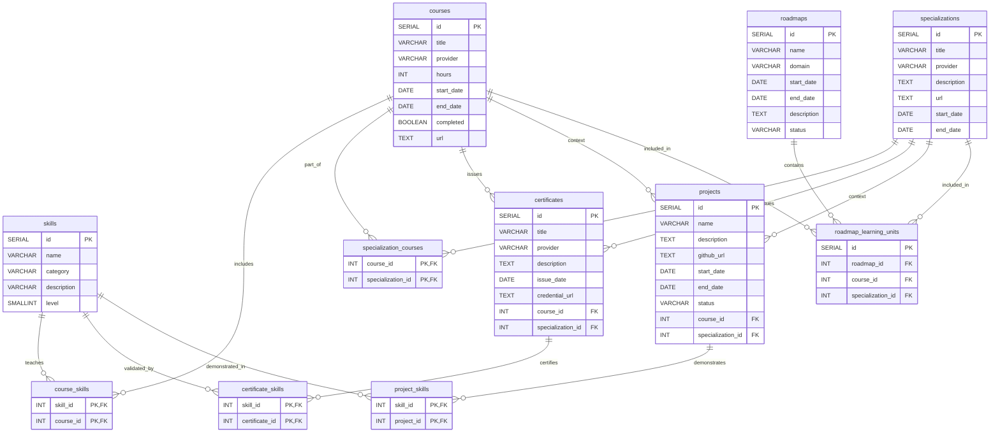

# Design Document

By Hossam Jamjama

Video overview: https://youtu.be/L-BXBjZc3SU

---

# Scope

## Purpose of the Database

**SelfLearnLedger** is a relational database designed to structure, quantify, and analyze a self-directed learning journey. It transforms unstructured learning artifacts—such as courses, certificates, projects, and roadmaps—into normalized, queryable relational data.

Self-taught learners often accumulate:

* Dozens of courses
* Multiple certifications
* Independent projects
* Structured learning plans

However, without a formal system, it becomes difficult to:

* Track skill growth over time
* Identify knowledge gaps
* Measure roadmap completion
* Demonstrate competency depth
* Quantify total learning investment

This database solves that problem by modeling learning as a **skill-centric relational system**, where all educational artifacts connect back to canonical skills.

The system emphasizes analytical insight over simple record storage.

---

## Included in Scope

The database models the following entities:

* Skills
* Courses
* Specializations
* Certificates
* Projects
* Roadmaps
* Learning units inside roadmaps
* Many-to-many relationships between them

It also includes:

* Analytical views
* Automated triggers
* Derived relational views
* Performance indexes

The design currently supports **a single learner’s portfolio**, but it can be extended to multi-user support in future iterations.

---

## Outside the Scope

The database does not:

* Handle authentication or user accounts
* Store employer or recruiter data
* Scrape course metadata automatically
* Validate certificate authenticity
* Generate resumes
* Provide visual dashboards
* Perform AI-based skill inference
* Store informal learning experiences

It is strictly a relational data model and analytical engine.

---

# Functional Requirements

A user should be able to:

### 1. Store structured records of:

* Skills
* Courses
* Specializations
* Certificates
* Projects
* Roadmaps

### 2. Connect entities through relationships:

* Courses ↔ Skills
* Projects ↔ Skills
* Certificates ↔ Skills
* Specializations ↔ Courses
* Roadmaps ↔ Courses or Specializations

### 3. Query analytical insights:

* How many sources validate a skill
* Skills demonstrated in projects
* Skills covered but not demonstrated
* Total hours studied
* Roadmap completion percentage
* Portfolio summary metrics

### 4. Automatically enforce logic:

* Update skill level based on exposure
* Prevent deletion of certificate-linked skills
* Mark courses completed when end_date is set
* Auto-complete roadmaps when all skills are demonstrated
* Maintain strict referential integrity

The database is designed to support analytical queries and automation logic, not just CRUD operations.

---

# Representation

## Core Entities

## 1. Skills

Attributes:

* id (SERIAL, PK)
* name (VARCHAR, UNIQUE, NOT NULL)
* category (VARCHAR)
* description (VARCHAR)
* level (SMALLINT, CHECK 1–5)

Rationale:

Skills are the central entity. Every learning artifact connects to skills.

The level attribute represents a heuristic strength score automatically updated through triggers based on exposure in courses and projects.

A CHECK constraint enforces level boundaries (1–5).

---

## 2. Courses

Attributes:

* id (SERIAL, PK)
* title (VARCHAR, NOT NULL)
* provider (VARCHAR, NOT NULL)
* hours (INT)
* start_date (DATE)
* end_date (DATE)
* completed (BOOLEAN, default FALSE)
* url (TEXT)

Constraints:

* CHECK ensures end_date ≥ start_date
* Trigger automatically marks completed = TRUE when end_date is set

Courses represent atomic learning units.

---

## 3. Specializations

Attributes:

* id (SERIAL, PK)
* title (VARCHAR, NOT NULL)
* provider (VARCHAR, NOT NULL)
* description (TEXT)
* url (TEXT)
* start_date (DATE)
* end_date (DATE)

Specializations group multiple courses.

They are connected through the specialization_courses junction table.

---

## 4. Certificates

Attributes:

* id (SERIAL, PK)
* title (VARCHAR, NOT NULL)
* provider (VARCHAR, NOT NULL)
* description (TEXT)
* issue_date (DATE)
* credential_url (TEXT)
* course_id (FK, nullable)
* specialization_id (FK, nullable)

Constraint:

A CHECK constraint enforces exclusive ownership:

* A certificate must belong to either a course OR a specialization (but not both).

Certificates validate skill acquisition but do not store skills directly; those relationships are handled in certificate_skills.

---

## 5. Projects

Attributes:

* id (SERIAL, PK)
* name (VARCHAR, NOT NULL)
* description (TEXT)
* github_url (TEXT)
* start_date (DATE)
* end_date (DATE)
* status (CHECK: planned, in_progress, completed)
* course_id (FK, optional)
* specialization_id (FK, optional)

Projects demonstrate skills in practical implementation contexts.

---

## 6. Roadmaps

Attributes:

* id (SERIAL, PK)
* name (VARCHAR, NOT NULL)
* domain (VARCHAR)
* start_date (DATE)
* end_date (DATE)
* description (TEXT)
* status (VARCHAR)

Roadmaps represent structured learning plans composed of courses and/or specializations.

They do not store skills directly; skills are derived dynamically.

---

# Relationship Tables

The system includes normalized many-to-many junction tables:

* course_skills
* project_skills
* certificate_skills
* specialization_courses

Additionally:

### roadmap_learning_units

This table defines which learning units (courses or specializations) belong to a roadmap.

Each row represents exactly one unit, enforced by a CHECK constraint ensuring:

* Either course_id is set
* Or specialization_id is set
* But not both

This polymorphic design keeps the roadmap flexible without duplicating structure.

All junction tables use composite primary keys to prevent duplicate mappings.

---

# Derived Views

The database includes several analytical views.

---

## roadmap_skills (Derived View)

This view dynamically derives skills for each roadmap:

* Direct course skills
* Skills from courses inside specializations

It prevents redundant storage and ensures roadmap skill coverage is always up-to-date.

---

## skill_coverage

Aggregates how many independent sources validate each skill:

* Number of courses
* Number of projects
* Number of certificates

Used to measure skill depth.

---

## total_learning_hours

Aggregates total hours across all courses.

---

## roadmap_progress

Calculates the percentage of roadmap skills demonstrated in projects.

It compares:

* DISTINCT skills targeted by roadmap
* DISTINCT skills demonstrated in projects

Prevents duplication inflation through DISTINCT usage.

---

## portfolio_summary

Provides high-level totals:

* Total skills
* Total projects
* Total certificates
* Total courses

---

# Automation & Triggers

The system includes automation logic.

---

## 1. Skill Level Auto-Update

Triggered after insertion into:

* course_skills
* project_skills

Rules:

* ≥3 courses AND ≥2 projects → Level 5
* ≥2 projects → Level 4
* ≥3 courses → Level 3
* Otherwise → Level 1

This creates a measurable heuristic for skill maturity.

---

## 2. Prevent Deleting Core Skills

A BEFORE DELETE trigger prevents deletion of skills linked to certificates.

This protects validated competencies from accidental removal.

---

## 3. Auto Mark Course Completed

If end_date is set during update, completed is automatically set to TRUE.

Ensures state consistency.

---

## 4. Auto Update Roadmap Status

When project_skills are inserted, the system checks:

If all roadmap skills are demonstrated, then:

* status = 'completed'
* end_date = CURRENT_DATE

This provides milestone automation.

---

# Entity Relationship Diagram

---

# Optimizations

## Indexes

Indexes are created on:

* Foreign keys in junction tables
* Frequently filtered status fields
* Skill lookup columns

These improve JOIN and aggregation performance in analytical queries.

---

## Constraints

The design uses:

* CHECK constraints for logical validation
* Composite primary keys for M:N integrity
* ON DELETE CASCADE for relational cleanup
* Exclusive ownership constraints (certificates, roadmap units)

---

# Limitations

1. Single-User Design
   No user table is present.

2. Heuristic Skill Level
   Level is exposure-based, not competency-based.

3. No Weighting
   All sources contribute equally to skill strength.

4. No Version Tracking
   Skills do not track framework or language versions.

5. Status Derivation Edge Cases
   Roadmap completion depends on trigger timing and may require recalculation if relationships change.

---

# Conclusion

SelfLearnLedger transforms informal self-learning into a structured, normalized relational system.

The design emphasizes:

* Skill-centric modeling
* Strict normalization
* Derived relational logic
* Automated integrity enforcement
* Analytical capability

This project demonstrates advanced SQL concepts including:

* Many-to-many relationships
* Composite primary keys
* Polymorphic association via constrained nullable FKs
* CHECK constraints
* Analytical views
* Trigger-based automation
* Aggregation and JOIN optimization

It provides a strong foundation for a scalable learning-portfolio system and reflects production-oriented relational design principles.
